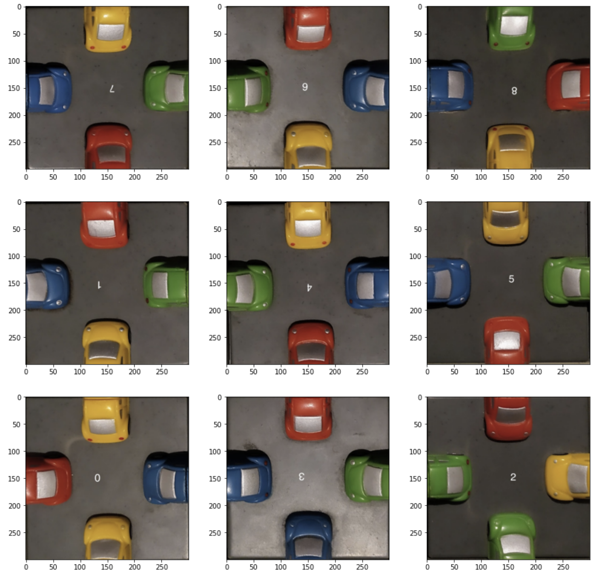

# carpuzzle

## Solving an old combinatorial puzzle with Python

The puzzle is straightforward: it involves arranging $9$ square tiles into a $3\times 3$ grid. Each tile features half of a colored plastic car on each of its four sides. The objective is to place the tiles in a way that ensures all adjacent car slices match up perfectly - not only do the colors have to match, but the front and back of each car should be aligned as well.

This is a correct match:

This is not a correct match:

## The math

The first unknown we encounter naturally is the number of possible configurations for the puzzle, both admissible and inadmissible. To calculate this value, we can break it down into two parts:

- Firstly, we observe that there are $9!$ ways to arrange the 9 tiles in the 9 squares of the 3x3 grid.
- Secondly, we note that each arrangement can produce new configurations through rotation. With four possible orientations for each tile, we have a total of $4^9$ variations.

By multiplying these two results, we obtain a total of $4^9 \cdot 9!$ possible configurations, which comes out to $95,126,814,720$ (95 billion) different arrangements.

**Naïve Approach:**

The most straightforward approach would be to try out each combination until a solution is found, but with 95 billion possible configurations (and no guarantee of a unique solution), this strategy is impractical unless you have access to a supercomputer capable of dividing the task among multiple cores.

Even if we could check the admissibility of each configuration in 0.01 seconds, it would still take an impossibly long time to consider every possible arrangement. In the worst-case scenario, we would have to wait for 30 [years to exhaust all the options.](https://www.google.com/search?q=(4%5E9)*(9!)*0.01+seconds+to+years&rlz=1C5CHFA_enCL1033CL1033&oq=(4%5E9)*(9!)*0.01+seconds+to+years&aqs=chrome.0.69i59j6.4153j0j7&sourceid=chrome&ie=UTF-8).

## The code

I've created a Python repository that features a [backtracking](https://en.wikipedia.org/wiki/Backtracking) solution for this puzzle, which I implemented purely for fun. The code is extensively documented, so feel free to take a look if you're interested.

I've also included an example in the notebook [visualizations.ipynb](visualization.ipynb), which uses images of the actual puzzle. The algorithm was able to find a solution, which is depicted in the following image:

 

### TODO:

- add a general explanation of the solver to the README file
- explain how to contribute/install
