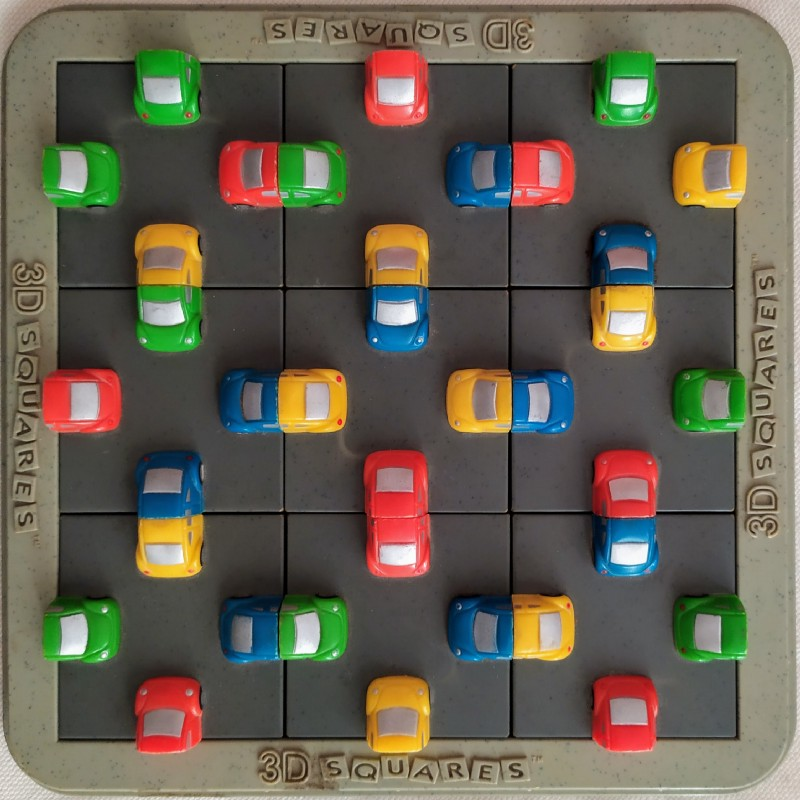
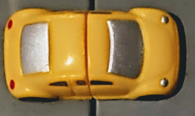
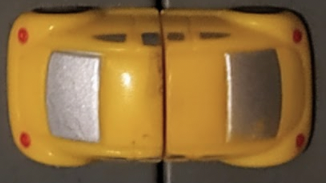

# carpuzzle
## Solving an old combinatorial puzzle with Python

The puzzle is simple. It consists of a 3x3 grid in which we must place 9 square tiles. Each tile has (on each of its 4 faces) half of a colored plastic car (a car slice). The goal of the puzzle is to determine how to arrange the tiles so that all car slices on adjacent tiles match, i.e. that the color of the cars is the same and that if on one side we have the front of the car, on the other we have the back.

This is a correct match:

This is not a correct match:

## The math

The first unknown that appears naturally is the number of possible configurations (both admissible and inadmissible) of the puzzle. To determine this value, we split the calculation into two parts:

- First we notice that there are 9! ways to assign the 9 tiles to the 9 squares of the 3x3 grid.
- Secondly, we note that in each assignment, we can obtain new configurations by rotating the tiles within their respective boxes. As there are 4 possible orientations in which we can rotate each tile, we have that there are 4^9 possible variations of this assignment.

Combining the two previous results we have that there are 4⁹·9! possible configurations. This equates to 95,126,814,720 configurations (95 billion).

**Naïve Approach:**

The simplest idea would be to try the combinations one by one until a solution is found (will this solution be unique?). Now, 95 trillion configurations rules out this alternative unless you have a supercomputer (to divide the task between different cores). We note that even if checking the admissibility of each configuration took 0.01 seconds, in the worst case we would have to wait 723 years.

## The Code

In this python repository I implemented (just fo fun) a [backtracking](https://en.wikipedia.org/wiki/Backtracking) solution to the puzzle which is extensibly documented. You are very welcome to take a look.

There is an example using the actual images in the notebook [visualizations.ipynb](visualization.ipynb)

### TODO:

- fix orientaton bug in imgs
